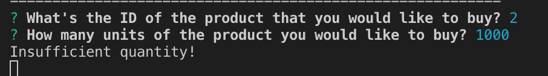

# Bamazon
### What is Bamazon?
Bamazon is a CLI APP, an Amazon-like storefront that will take in orders from customers and track the updated inventory, as well as sending the calculation of total cost to customers. For Managers, Bamazon can help them with easy-to-operate functions including: view products for sale, view low inventory, add to inventory,and add new product. 

### How to use Bamazon?
There are two ways to use Bamazon, depending on whether you are a customer or a manager. 

**_For Customers:_**
1. Open bamazonCustomer.js file. 

2. Open your terminal and run the code `npm install` to install all the dependencies necessary to run the app. 

3. In your terminal, run the code `node bamazonCustomer.js` and you will see a list of all available sale items with their ids, names, and prices. The app will also ask you the id of the product that you would like to buy. 

4. Put in the ID (ex.2) and units of the product (ex.100) that you would like to buy. If the units didn't exceed the inventory, it will show you the units left in stock and updated units in stock, price per unit, and your total cost of purchase. When you refresh your SQL database (i.e. run `SELECT * FROM products` in your sql workbench), you will see the updated database. 

However, if the units exceeded the inventory, the app will alert you "Insufficient quantity", and prevent the order from going through.

**_For Managers:_**
1. Open bamazonManager.js file.

2. Open your terminal and run the code `npm install` to install all the dependencies necessary to run the app. 

3. In your terminal, run the code `node bamazonManager.js`, and the app will pop up a question asking you what you would like to do. Choose one from the four options. 

- If you select `View Products for Sale`, the app should list every available item: the item IDs, names, prices, and quantities.

- If you select `View Low Inventory`, then it should list all items with an inventory count lower than five.

- If you select `Add to Inventory`, your app should display a prompt that will let you "add more" of any item currently in the store.

- If you select `Add New Product`, it should allow you to add a completely new product to the store.

You can view the updated sql database in your sql workbench. 

### Contact Information 
General inquiries at ddzhang2018@gmail.com.
